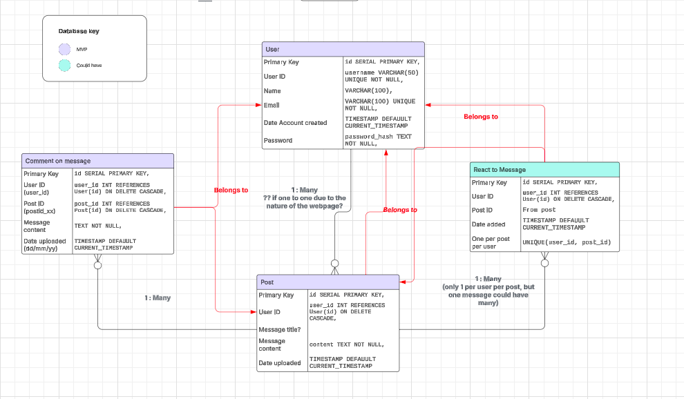

# Message Board

## Introduction
Message Board is a full-stack web application that allows users to post messages for others to see. Whether it’s a note of appreciation, a public announcement, or a simple thought to share, the site provides a clean and easy way to express yourself. Leveraging Django, Message Board seamlessly manages user authentication and message posting, all within a welcoming user experience.

Message Board is the result of a 3-day hackathon by a team of developers:

* Alex Aspinall
* Jess Howkins
* Jude Woolls
* Kate Elliott

This project is open source and can be forked for customisation.  

A special edition of Message Board—**Thank You, Dillon!**—was built for us, and fellow students, to express our appreciation for Code Institute Facilitator Dillon Mc Caffrey. Deployed, documented, and delivered with gratitude.

<a href="https://messageboard1-f1454f42f245.herokuapp.com/" target="_blank">View the deployed site here.</a>

## Agile

To ensure we delivered a minimum viable product (MVP) in the hackathon's allotted time frame, as a team we used MoSCoW prioritisation. Doing so allowed us to determine the MVP from the offset and work effectively to reach this first. The <a href="" target="_blank">project board</a> shows the complete user stories along with their acceptance criteria. The user stories are also laid out below within UX Design.

## UX Design
### User Stories

The <a href="" target="_blank">project board</a> shows the complete user stories along with their acceptance criteria.

Must Have

* As a user, I can submit a thank-you message so that I can express my appreciation for the facilitator
* As a user, I can see all thank-you messages displayed on the board so that I can read what others have written.
* As a user, I can use a form with validation so that I don't submit an empty or invalid message.
* As an admin, I can remove inappropriate messages so that the board stays respectful and relevant.
* As a user, I can see a visually appealing message board so that it feels engaging and pleasant to use.
* As a user, I can access the message board on different devices so that I can participate from a phone, tablet, or computer.

Should Have

* As a user, I can edit or delete my own messages so that I can correct mistakes or remove unwanted posts.
* As a user, I can see timestamps on messages so that I know when each message was posted.

Could Have

* As a user, I can filter or search for messages so that I can easily find specific posts.
* As a user, I can react or 'like' messages so that popular messages get highlighted.
* As a user I would like to be able to upload a picture or gif to express my gratitude.
* As a User I would like the webpage to automatically update so I don't miss any new messages.

## Branding

### Fonts

Message Board uses 'Luckiest Guy' as a bold, mostly uppercase heading font and 'Shadows Into Light Two' for a body text that mimics handwriting. Both fonts are sourced from Google Fonts and there is a backup of 'sans-serif' applied on the site.

### Colour Palette

Message Board features a bold and vibrant colour palette, designed to create a welcoming and engaging experience. The chosen colours are carefully combined on the live site to ensure accessibility and readability.

View

### Imagery

All imagery for Message Board is from Canva, including the logo design and customisable graphics.

View

### Wireframes

**Insert image** 

### Responsiveness

**Insert image** 

View

## ERD

View

    
## Features

### Existing Features

### Future Features

* ...

## Deployment
- **Platform:** Heroku
- **High-Level Deployment Steps:** 
  1. Ensure project is set correctly for deployment
  2. Push code to Github
  3. Deploy from main in Heroku dashboard
- **Verification and Validation:**
  - All CRUD operations were retested manually in the deployed version. Often this was faster for making DB changes than spooling up the local server.
- **Security Measures:**
  - Use of environment variables for sensitive data.
  - Ensured DEBUG mode is disabled in production.

 <a href="https://messageboard1-f1454f42f245.herokuapp.com/" target="_blank">View the deployed site here.</a>

## AI Implementation and Orchestration
### Use Cases and Reflections:
  - **Code Suggestions and Autocompletion:**
    - AI tools like GitHub Copilot have been instrumental in providing code suggestions and autocompletion, significantly speeding up the development process and reducing the likelihood of syntax errors.
  - **Automated Testing:**
    - AI has been used to generate a test cases, ensuring the robustness and reliability of the application.

- **Overall Impact:**
  - The integration of AI tools has streamlined the development workflow, enhanced code quality, and improved the efficiency of testing and content moderation processes.

## Testing

...

## Credits
### Code
* ...

### Content
* ...

### Media
* Canva

## Acknowledgements
A huge thank you to Dillon Mc Caffrey for inspiring this project and providing support and kindness throughout our entire time studying with Code Institute.
